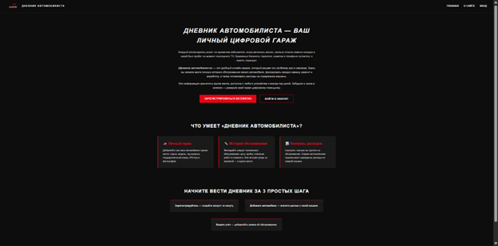
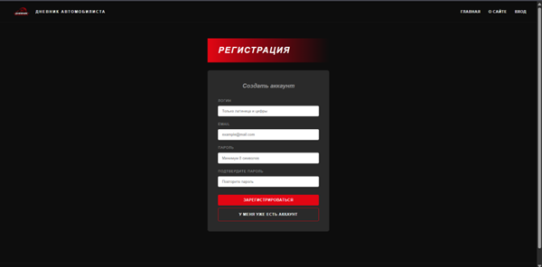
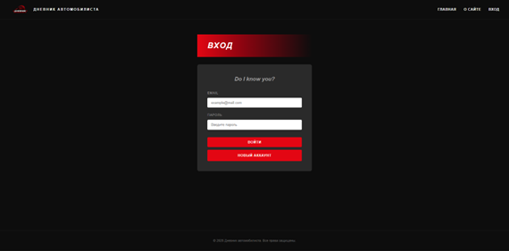
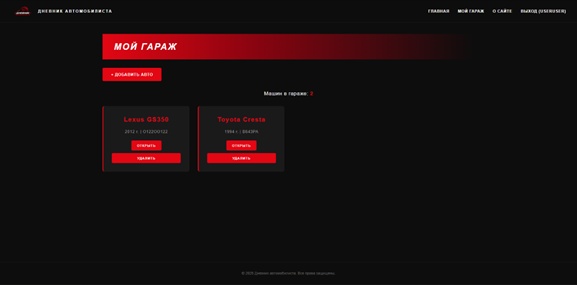
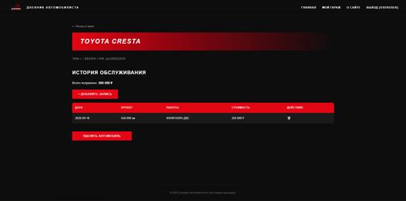
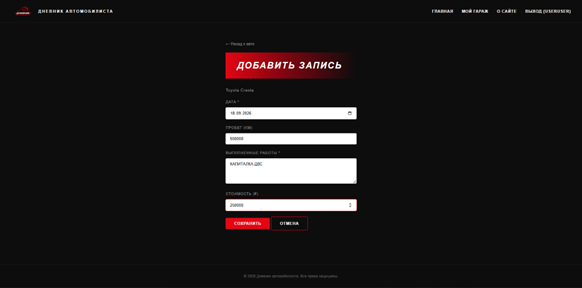
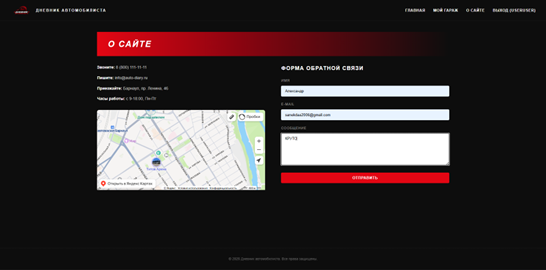
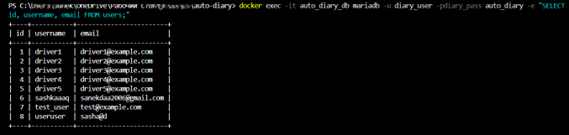

# Дневник автомобилиста

Pet-проект — веб-сервис для учёта автомобилей и истории их обслуживания.

## О проекте

MVC-приложение на PHP и MariaDB, контейнеризированное через Docker Compose.

**Стек:** PHP, MariaDB, HTML, CSS, JavaScript, Docker, Git.

**Что реализовано:**
- Регистрация и авторизация пользователей с хэшированием паролей (`password_hash`, `password_verify`).
- CRUD для автомобилей и записей об обслуживании.
- Разграничение доступа: каждый пользователь видит только свои данные.
- Подсчёт суммарных расходов на обслуживание.
- Контейнеризация через Docker Compose (PHP + MariaDB).

**База данных:** таблицы `users`, `cars`, `maintenance` (связи «один ко многим»).

## Скриншоты интерфейса

### Главная страница

### Регистрация

### Вход

### Мой гараж

### История обслуживания автомобиля

### Добавление записи об обслуживании

### О сайте

### База данных (таблица users)

